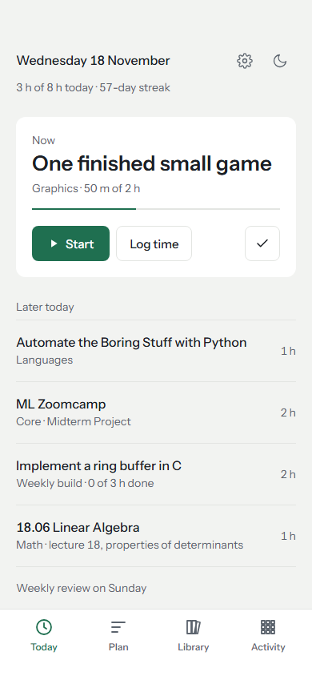
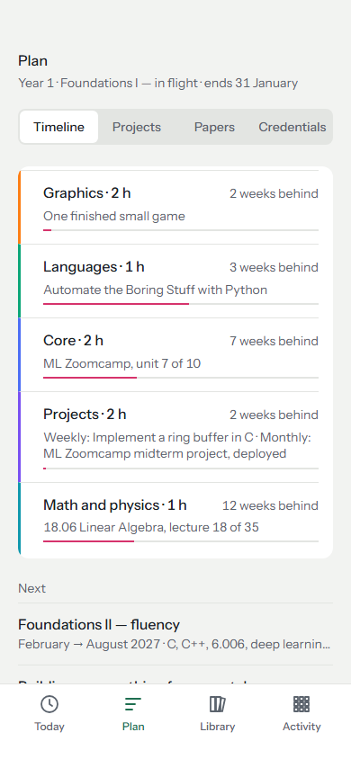
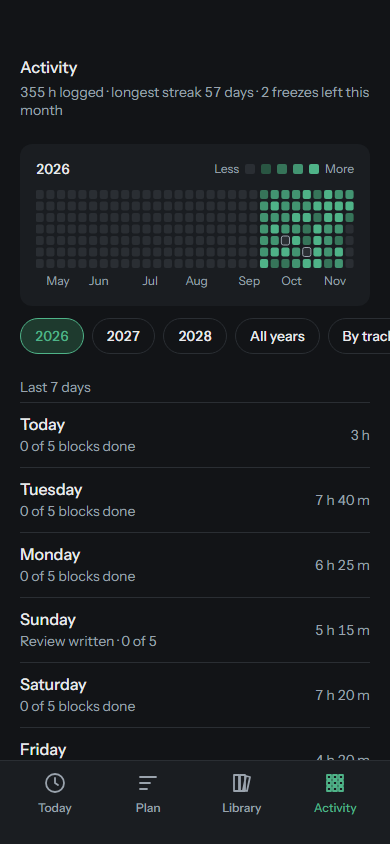
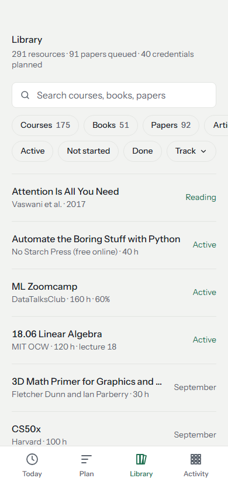
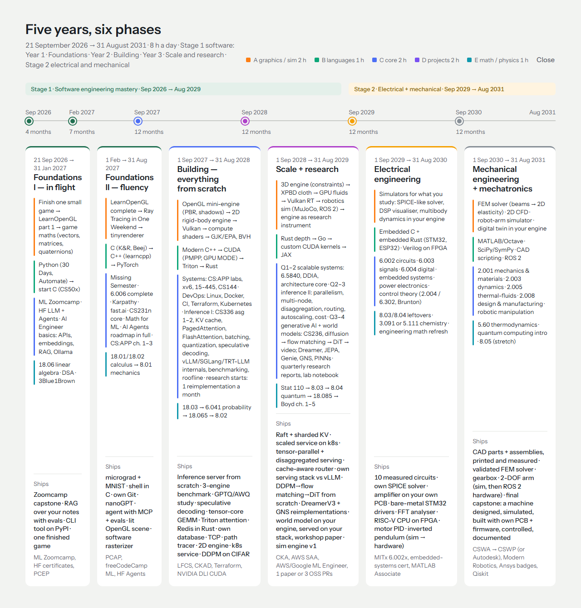
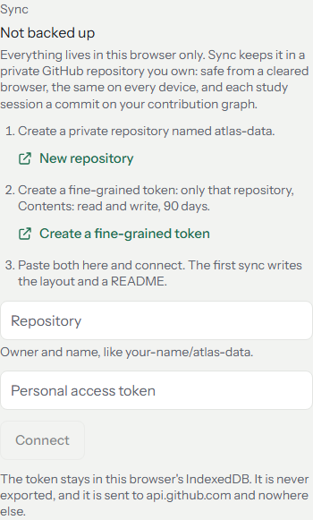
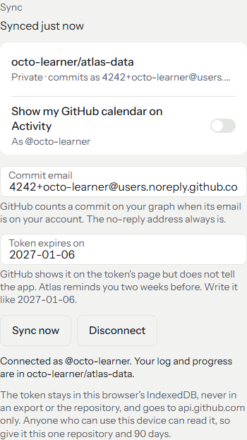

# Atlas

A local-first personal learning platform for one five-year plan (2026-09-21 to 2031-08-31). It answers
one question every morning: **what exactly do I do in my 8 hours today?**

No backend and no account. Everything you log is kept in your browser (IndexedDB), and with the optional
GitHub Sync also in a private repository you own, where each study session becomes a commit. Without it, the
app makes no network calls at all, and everything can still be exported to a single JSON file.

> Build status: see [PROGRESS.md](PROGRESS.md). Choices and assumptions: see [DECISIONS.md](DECISIONS.md).

<p>
  
  
  
  
</p>



The screenshots show eight weeks of made-up history. They are also the baselines of a screenshot test, and
`npm run screenshots` redraws them after a change to the UI.

## Run it

Requires Node 22.18 or newer (the scripts use Node's built-in TypeScript support).

```bash
npm i
npm run dev
```

| Command | What it does |
|---|---|
| `npm run dev` | Dev server with hot reload; editing a file under `data/` reloads the app. |
| `npm run build` | `validate:data`, then typecheck, then the production build into `dist/`. |
| `npm test` | Unit tests (Vitest), run in UTC+5 on purpose. |
| `npm run test:e2e` | Builds, then runs the Playwright smoke tests against the production build. |
| `npm run validate:data` | Validates everything under `data/`. Fails on schema errors, duplicate ids, dangling references. |
| `npm run check:links` | Requests every URL in `data/` and prints a report. Never fails the build. |
| `npm run log:export` | Writes each logged day from a backup to `learning-log/YYYY/MM/DD.md` (see below). |
| `npm run screenshots` | Builds, then redraws the screenshots above (the screenshot test's baselines in `screenshots/`) from demo data. |
| `npm run fetch:units` | Rebuilds the lecture and chapter checklists from the courses own syllabus pages. |
| `npm run test:sync -- --repo owner/name` | Runs GitHub Sync against the real GitHub, by hand (see below). Never in CI. |

## Keyboard

| Key | Does |
|---|---|
| `t` | Go to Today |
| `r` | Go to the Plan |
| `/` | Search: the page's own search box, or the Library's |
| `l` | Log time: opens the log form on Today, with the cursor in it |
| `?` | List the shortcuts |

They never fire while you type, or with Ctrl, Alt or Cmd held, and Settings > Keyboard turns them off, for
anyone using speech input. In the heatmap, Tab lands on one day, the arrow keys move by a day or a week, and
Enter opens it.

## Deploy

Pushing to `main` builds and deploys to GitHub Pages (`.github/workflows/deploy.yml`). One-time setup in
the repository: **Settings > Pages > Build and deployment > Source = "GitHub Actions"**.

## GitHub Sync (optional)

Off until you connect it. With it on, a private GitHub repository is where your log and progress live, and the
browser keeps a copy that works offline. Clearing the browser or changing devices loses nothing, and every
study session is a commit on your contribution graph.

<p>
  
  
</p>

**Setting it up** (Settings > Sync):

1. [Create a private repository](https://github.com/new) named `atlas-data`. Leave it empty or add a README.
2. [Create a fine-grained personal access token](https://github.com/settings/personal-access-tokens/new):
   - Repository access: only select repositories, then `atlas-data`.
   - Permissions: Contents, read and write. Nothing else.
   - Expiration: 90 days.
3. Paste the repository (`your-name/atlas-data`) and the token into Settings > Sync, then Connect. Atlas checks
   both with GitHub, then runs the first sync. An empty repository gets a README and the whole layout. A
   repository another device already uses is merged with what this browser has.
4. Type the token's expiry date into "Token expires on". GitHub shows it on the token's page but does not let
   the app read it. Atlas reminds you two weeks before.

On another device, connect the same repository: the first sync brings everything over.

**What ends up in the repository.** Plain JSON and Markdown, readable on GitHub and editable by hand; the
README that Atlas writes into it explains each file.

| Path | What is in it |
|---|---|
| `state/items.json` | Status, ticked units, notes and links of every course, book, project, paper, certificate and milestone |
| `state/plan.json` | Your plan edits, items of your own, re-plans and picked builds |
| `state/settings.json` | Blocks, thresholds, streak rules and theme. Never the token. |
| `log/YYYY/MM/YYYY-MM-DD.json` and `.md` | One day, and its human-readable twin |
| `reviews/` | Weekly, monthly and quarterly reviews |
| `projects/` | Each project's write-up, links and checklist |
| `research/` | Your research reports. Atlas never writes here. |

**How it behaves.**

- Every change is saved in the browser first, so the app never waits for the network.
- Changes go to GitHub in one commit per sync: 3 seconds after a block or item is marked done, a timer stops or
  a review is saved; otherwise 60 seconds after the last change; and when you leave the page. Commit messages
  read like `log: 2026-10-07 · 8 h 10 m · 5/5 blocks`.
- Atlas checks GitHub when it opens and every 5 minutes while it is on screen.
- When two devices changed the same day, their entries are merged, and the later edit of each entry wins.
  Settings and plan edits keep the newer version, with a short notice.
- Offline, changes wait. Settings says how many ("Offline, 3 changes waiting"), and so does a quiet line at the
  foot of Today when they have been waiting a while. There are no banners.
- Commits are authored with your GitHub no-reply address, so they count on your graph; Settings can change it.
- **Disconnect** forgets the token and the repository, and keeps everything in the browser and on GitHub.
  **Reset everything**, with Sync on, clears only this browser; the next sync brings it back.

**The token** stays in this browser's IndexedDB. It is never exported, never written to either repository, and
sent only to `api.github.com`. Anyone who can use the device could read it, which is why it should reach only
this one repository and expire after 90 days. The calendar switch in Settings > Sync uses the same token to draw
your real GitHub contribution calendar under the Atlas heatmap on Activity.

**Checking it against the real GitHub.** `npm run test:sync` runs one full cycle with two in-memory devices:
connect, write, flush, a second device pulls, both edit the same day, merge. It works on a throwaway branch of a
repository you name, which it creates and deletes, and reads the token from the environment:

```bash
ATLAS_SYNC_TOKEN=github_pat_... npm run test:sync -- --repo your-name/atlas-sync-test
```

Use a throwaway repository with at least one commit, and a token for that repository only. `--fake` runs the
same cycle against the in-memory GitHub of the tests, and `--keep` leaves the branch for a look at its commits.

**Without Sync**, Settings says "Not backed up", once, and nowhere else. Export a file now and then (Settings >
Export everything). `npm run log:export` still turns a backup into a public Markdown learning log
(`learning-log/YYYY/MM/DD.md`, reflections left out unless you add `--reflections`).

## Editing the curriculum

Everything you study lives in `data/`, as YAML. Nothing about it is hard-coded in the app, and your logs,
statuses and notes reference items by id, so editing the curriculum never loses them.

| File | What is in it |
|---|---|
| `data/phases.yaml` | The six phases, and the focus of each lane in each |
| `data/plan.yaml` | Which item sits in which lane of which phase, in order |
| `data/resources/*.yaml` | Courses, books, lecture series and repositories |
| `data/units/*.yaml` | The lecture, chapter and lab checklist of one resource (the file name is its id) |
| `data/projects/*.yaml` | Capstones, monthly builds and the weekly mini-build pool |
| `data/papers.yaml`, `data/paper-sources.yaml` | The reading queue, and where to find more |
| `data/certs.yaml`, `data/subjects.yaml` | Certifications, and the credential map |
| `data/roadmaps.yaml` | The five roadmap.sh roadmaps, as sections of nodes, each section with the phase that teaches it |
| `data/settings.yaml` | The defaults a fresh install starts from |

### Adding a course, step by step

1. Describe it in the file of its track, for example `data/resources/math.yaml`:

   ```yaml
   - id: my-probability-book          # unique across resources, projects, papers and certs
     title: "A probability book you picked"
     provider: Its publisher
     type: book                        # course, lectures, book, tutorial, article, paper, repo or cert
     url: null                         # no link until you have opened it yourself...
     urlVerified: false
     searchHint: "the book's title and author"   # ...and meanwhile, what to search for
     tracks: [math]
     level: intro
     cost: paid
     estHours: 60
     prerequisites: [mit-18-06]        # never scheduled before these
     subject: math-physics             # its row in the credential map (data/subjects.yaml)
     summary: "Why it is on the list, in one sentence."
     short: "Probability"              # optional: the name lists show when the title is long
     covers: [ai-engineer/embeddings]  # optional: roadmap.sh nodes it ticks when done
   ```

   Once you have opened the page, set `url`, `urlVerified: true` and `lastVerified` to that day.

2. Put it on the roadmap: add `- { resource: my-probability-book }` to a lane of a phase in
   `data/plan.yaml`. The order of the list is the order of the lane. To spread one item over two lanes or
   two years (a book begun in year 2 and finished in year 3), list it in both places with `hours:` on each.
   For part of a course ("selected lectures"), one entry with `hours:` is enough.

3. If it has chapters or lectures to tick off, list them in `data/units/my-probability-book.yaml`:

   ```yaml
   - { id: ch-1, title: "Chapter 1: Counting" }
   - { id: ch-2, title: "Chapter 2: Conditional probability" }
   ```

   Progress is stored against these ids, so rename titles freely but keep the ids.

4. Run `npm run validate:data`, then `npm run dev` to see it.

A project works the same way in `data/projects/*.yaml`, with acceptance criteria instead of units. Anything
you would rather not put in a file can be added from the app instead (Library > Add a resource, or Plan > a
lane > Edit > "Add to this lane"); those additions live in your browser and travel in backups.

A roadmap.sh node's id is the slug of its label in `data/roadmaps.yaml`: "Ops:Byte Ratio" is
`ops-byte-ratio`. An item that `covers` a node ticks it on Plan > Credentials > Roadmaps once the item is done.
Nodes marked `optional: true` (vendor-specific or engine-specific ones) are left out of the coverage percent.

After an edit, run `npm run validate:data`. It fails on a schema error, a duplicate id, a dangling
reference, a prerequisite cycle, an item planned before its prerequisite, or a roadmap item with no row in
the credential map. Two rules are worth knowing up front:

- **ids must be unique across resources, projects, papers and certs**, because a log entry references them
  without saying which kind it means;
- **a `covers` entry must name a real node**, written `roadmap-id/node-id`;
- **a URL is either verified or absent.** Set `url: null` with a `searchHint` rather than writing down a
  link you have not opened; the app then shows the item with a "find link" badge.
